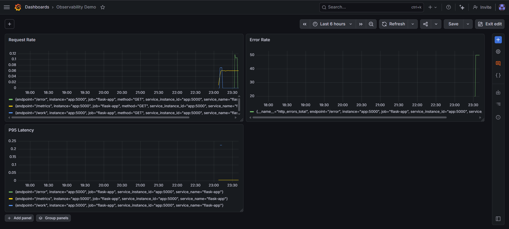

# Full Observability Stack

A complete three-pillar observability stack shipping metrics, logs, and distributed traces to Grafana Cloud using OpenTelemetry.

## Stack

| Tool | Purpose |
|---|---|
| Flask | Instrumented Python microservice |
| Prometheus client | Exposes /metrics endpoint |
| OpenTelemetry SDK | Auto-instruments traces |
| Structlog | Structured JSON logging |
| OTel Collector | Receives all telemetry, routes to Grafana Cloud |
| Grafana Cloud | Unified dashboard — metrics + logs + traces |

## Architecture

```
Flask App → OTel Collector → Grafana Cloud (Prometheus + Loki + Tempo)
```

## What is instrumented

- **Metrics** — request count, error count, P95 latency per endpoint
- **Traces** — every request generates a trace with spans
- **Logs** — structured JSON logs with trace_id field for correlation

## Endpoints

| Endpoint | Purpose |
|---|---|
| / | Index |
| /health | Health check |
| /work | Simulates processing with random latency |
| /error | Simulates 500 errors |
| /slow | Simulates slow responses (0.5–2s) |
| /metrics | Prometheus scrape endpoint |

## Grafana Dashboard

Three panels:
- **Request Rate** — `rate(http_requests_total[5m])`
- **Error Rate** — `http_errors_total`
- **P95 Latency** — `histogram_quantile(0.95, rate(http_request_duration_seconds_bucket[5m]))`

## Run locally

```bash
# Add credentials to .env (see .env.example)
docker compose up -d

# Generate traffic
curl http://localhost:5000/work
curl http://localhost:5000/error

# Stop
docker compose down
```
## Dashboard Screenshot


